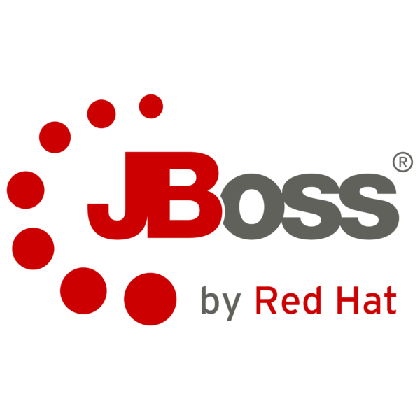

<p align="center">
 
 <h2 align="center">CRUD API REST Spring</h2>
 <p align="center">
    API construído em JAVA utilizando MySQL, MongoDB, PostgreSQL, Spring Boot 2, JPA, Hibernate </p>
 </p>
  <p align="center">
    <a href="https://github.com/ahsouza/github-readme-stats/actions">
      
    </a>
    <a href="https://codecov.io/gh/ahsouza/github-readme-stats">
      
    </a>
    <a href="https://a.paddle.com/v2/click/16413/119403?link=1227">
      
    </a>
    <a href="https://a.paddle.com/v2/click/16413/119403?link=2345">
      
    </a>
  </p>
  <div style="display: flex" align="center">
        
  </div>
</p>

<br>
<br>
<br>

## Estrutura de Arquivos & Pastas

```
branch: master

└📂 docs
  ├📂 assets
   ├📂img
    ├📄 java.png
    ├📄 jb-red-hat.png
    ├📄 mysql.png
    ├📄 postgresql.png
    ├📄 spring-boot.png
  └📄 .gitignore
├📄 readme.md
```

<br>
<br>
<br>

| TECNOLOGIAS              | [API](https://pt.wikipedia.org/wiki/MEAN_(conjunto_de_software) |
| ------------------------ | :----------------------------------------------------------- |
| -                        | ✔ **Spring Boot 2** é um framework que torna fácil a criação de aplicações JAVA autossuficientes e robustas, possibilitando a execução imediata.
| -                        | ✔ **Hibernate** é um framework para o mapeamento objeto-relacional
| -                        | ✔ Banco de Dados **MySQL**, **MongoDB**, **PostgreSQL**
| -                        | ✔ **JPA** é um framework leve, baseado em POJOS (Plain Old Java Objects) para persistir objetos Java

<br>
<br>
<br>

Pré-requisitos para desenvolvimento:

- [Java JDK v8+](https://www.oracle.com/java/technologies/downloads)
- [maven v3+](https://maven.apache.org/download.cgi)
- [MySQL + SGBD Workbench](https://dev.mysql.com/downloads/workbench)
- [MongoDB + SGBD Robomongo](https://robomongo.org/download)
- [PostgreSQL](https://www.postgresql.org/download/)

<br>

